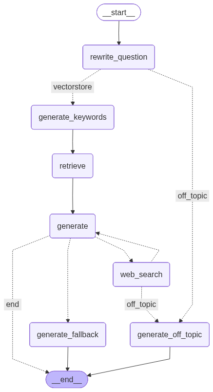

# Spanish Rock RAG Chatbot
A conversational assistant specialized in Spanish rock music, built as a Retrieval-Augmented Generation (RAG) system with a corrective retrieval loop. The assistant answers questions using a knowledge base automatically built from Wikipedia, falling back to live web search when the internal knowledge base is insufficient. Built with Meta Llama 3.


## Features
- **Specialized LLM chain architecture**: The system is composed of specialized LLM agents, each with a single responsiblity, orchestrated as a stateful graph.
- **Retrieval-Augmented Generation (RAG)**: Answers are grounded in a vector store built from Wikipedia articles using Chroma.
- **Hybrid search**: Dense and sparse (BM25) retrieval are combined through an ensemble retriever, then reranked with a cross-encoder.
- **Chat history**: A dedicated agent rewrites each question and the chat history into a standalone form before routing or retrieval, resolving pronouns and omitted references.
- **Self-correcting pipeline**: The graph falls back to web search when the internal knowledge base is insufficient or the generated answer is not grounded in the retrieved evidence.
- **Domain-scoped web search**: Web results are independently graded for topical relevance (Spanish rock music specifically) before being used to answer, filtering off-domain content.
- **Fully local inference**: The core LLM runs locally via Ollama, with no reliance on external LLM APIs for generation or grading.
- **Full-stack**: A React frontend consumes the FastAPI backend over a REST endpoint, with persistent chat history, loading states and error handling.

## Graph


The image above is generated with GraphVisualizerService and is not committed automatically. Regenerate it after any change to the graph topology:
```bash
python -m chatbot.backend.services.graph_visualizer
```

## Agents
| Agent | Responsibility |
|---|---|
| Question Rewriter | Rewrites the question into a standalone form, resolving pronouns and vague references from history |
| Question Router | Classifies the standalone question as in-scope (Spanish rock) or off-topic |
| Keyword Generator | Expands the standalone question into a retrieval-optimized keyword query |
| Web Results Grader | Ensures web search results are strictly about Spanish rock music before use |
| Answer Generator | Produces a grounded answer in Spanish, or an explicit fallback if evidence is insufficient |
| Hallucination Grader | Verifies that the generated answer is fully supported by the retrieved documents |

## Retrieval Pipeline
1. **Ingestion**: A recursive crawler traverses Wikipedia categories related to Spanish rock (bands and musicians), collecting articles and splitting them into overlapping chunks.
2. **Indexing**: Chunks are embedded with a multilingual sentence-transformer model and stored in a Chroma vector store; a BM25 index is built in parallel over the same corpus.
3. **Retrieval**: An ensemble retriever combines dense and sparse similarity scores.
4. **Reranking**: A cross-encoder reranks the combined candidates to select the most relevant chunks.

## Frontend
The chat interface is a React application that communicates with the backend through a REST endpoint.
- **Conversational UI**: User and assistant messages are rendered as a scrollable chat log, with distinct styling for user messages, assistant responses and error states.
- **Session persistence**: The conversation history is persisted in the browser so it survives page reloads, and can be cleared on demand.
- **UX details**: Loading indicators while the backend processes a request, auto-scroll to the latest message, and graceful error handling if the backend is unreachable.

## Tech Stack
- **Backend**: FastAPI, LangGraph, LangChain
- **Frontend**: React
- **LLM**: Ollama (local)
- **Vector store**: Chroma
- **Embeddings**: HuggingFace sentence-transformers
- **Reranking**: HuggingFace cross-encoder
- **Sparse retrieval**: BM25
- **Web search**: Tavily API

## Project Structure
```
chatbot/
├── backend/
│   ├── config/
│   │   └── config.py               # Centralized configuration
│   ├── graph/
│   │   ├── chains.py               # LLM chain definitions
│   │   ├── nodes.py                # Node and routing function implementations
│   │   └── graph_visualizer.py     # Graph PNG export
│   ├── prompts/
│   │   ├── prompts.py              # Chain prompt templates
│   │   └── grader_prompts.py       # Grading prompt templates
│   ├── rag/
│   │   ├── ingest.py               # Ingestion pipeline
│   │   ├── retriever.py            # Ensemble retriever and reranker setup
│   │   └── wikipedia.py            # Wikipedia category crawler
│   ├── routes/
│   │   ├── chat.py                 # Chat endpoint
│   │   └── health.py               # Health check endpoint
│   ├── schemas/
│   │   ├── message.py              # Request/response payloads
│   │   └── state.py                # Shared graph state definition
│   ├── services/
│   │    └── graph_service.py       # Graph construction and routing
│   └── main.py                     # FastAPI entry point
frontend/
└── src/
    └── App.jsx                     # Chat interface
```

## Configuration
Key parameters, defined in `chatbot/backend/config.py`:
 
| Variable | Description |
|---|---|
| `LLM_MODEL` | Ollama model used for all agents |
| `WRITER_LLM_MODEL` | Ollama model used for rewriting and answer generation |
| `CHUNK_SIZE` / `CHUNK_OVERLAP` | Document splitting parameters |
| `RETRIEVER_K` | Number of candidates retrieved before reranking |
| `RERANKER_TOP_N` | Number of documents kept after reranking |
| `SIMILARITY_WEIGHT` | Weighting between dense and sparse retrieval |
| `WEB_SEARCH_MAX_RESULTS` | Maximum web search results per query |
| `WIKI_ROOT_CATEGORIES` | Wikipedia categories used as crawl seeds |
| `WIKI_MAX_CATEGORY_DEPTH` | Maximum category traversal depth |
| `GRAPH_IMAGE_PATH` | Default output path for the generated graph image |
| `CHROMA_PATH` | Default output path for the generated vectorstore |

## Setup

### 1. Prerequisites
- Python 3.11+
- Node.js 18+
- [Ollama](https://ollama.com) installed locally, with the target models pulled (e.g. `ollama pull llama3`, `ollama pull qwen3:8b`)
- A [Tavily](https://tavily.com) API key, for web search fallback

### 2. Backend
```bash
python -m venv venv
venv\Scripts\activate
pip install -r requirements.txt
```

Create a `.env` file with:
 
```
WIKI_USER_AGENT=your-app-name (contact@example.com)
TAVILY_API_KEY=your-tavily-api-key
HF_TOKEN=your-huggingface-token
```

### 3. Build the knowledge base
Crawls the configured Wikipedia categories and builds the vector store:
 
```bash
python -m chatbot.backend.rag.ingest
```

### 4. Run the backend
```bash
uvicorn chatbot.backend.main:app --reload
```

### 5. Run the frontend
```bash
cd frontend
npm install
npm run dev
```

## Licensing and Attribution
 
This project is licensed under the MIT License. See [LICENSE](LICENSE) for details.
 
It relies on external content and models with their own licensing terms:
 
- **Wikipedia content**: Text retrieved and indexed from the Spanish Wikipedia is licensed under [Creative Commons Attribution-ShareAlike 4.0 (CC BY-SA 4.0)](https://creativecommons.org/licenses/by-sa/4.0/) and the [GNU Free Documentation License (GFDL)](https://www.gnu.org/licenses/fdl-1.3.html). Content generated by this chatbot from Wikipedia-derived context should retain attribution to Wikipedia and remain shareable under compatible terms if redistributed.
- **LLM model**: Inference is performed locally through Ollama using Meta's Llama 3, distributed under the [Meta Llama 3 Community License](https://llama.meta.com/llama3/license/). Use of the model is subject to that license's terms and acceptable use policy.
- **Writer LLM model**: Question rewriting and answer generation use Alibaba's Qwen3 (`qwen3:8b`) through Ollama, distributed under the [Apache License 2.0](https://ollama.com/library/qwen3:latest/blobs/d18a5cc71b84).
- **Embedding model**: `sentence-transformers/paraphrase-multilingual-MiniLM-L12-v2`, licensed under [Apache License 2.0](https://choosealicense.com/licenses/apache-2.0/).
- **Reranker model**: `cross-encoder/mmarco-mMiniLMv2-L12-H384-v1`, licensed under [Apache License 2.0](https://choosealicense.com/licenses/apache-2.0/).
- **Web search**: Live search results are retrieved via the Tavily API and are subject to [Tavily's terms of service](https://www.tavily.com/terms).
